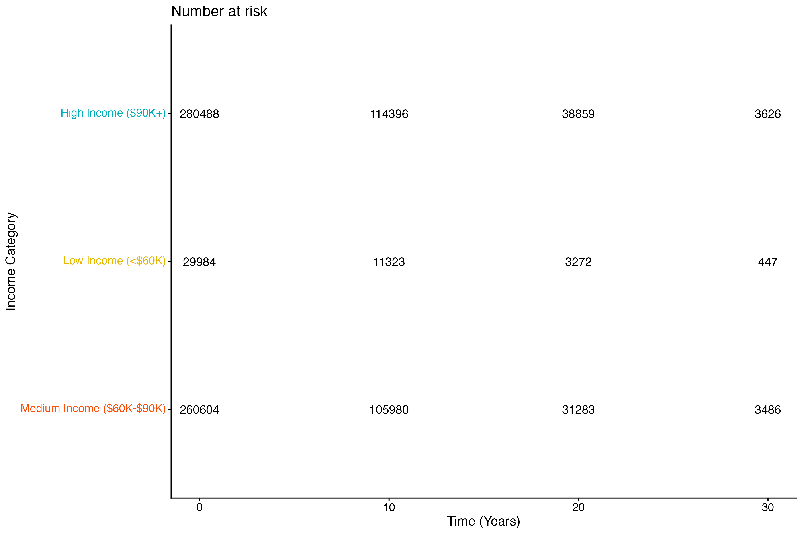
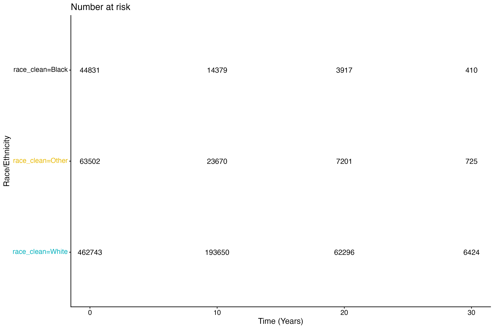
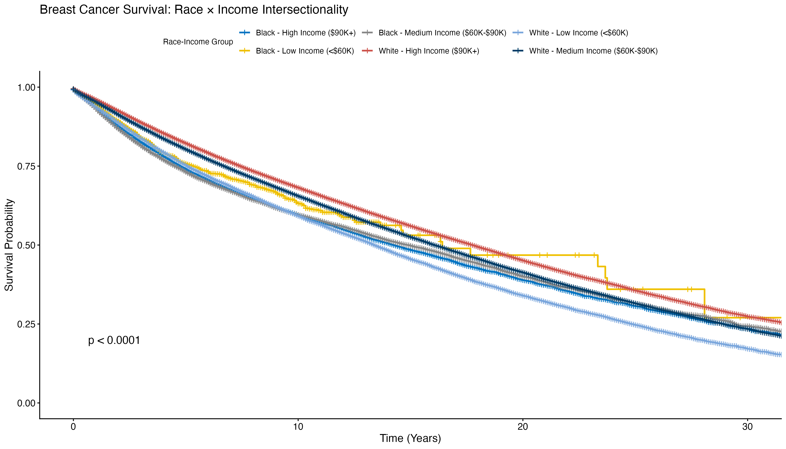
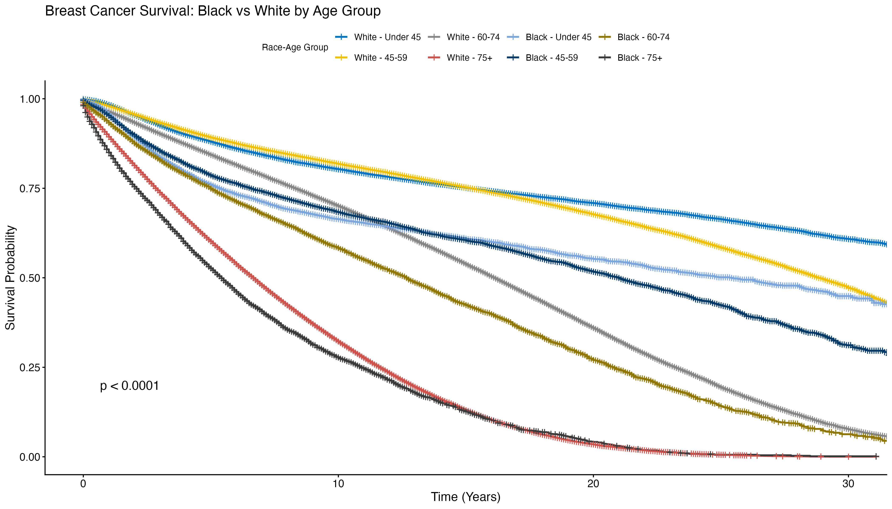

# Breast Cancer Survival Disparities: Race and Neighborhood Income Analysis

https://github.com/kgahanduke-25/breast-cancer-disparities/edit/main/README.md

**Author:** Kamalakanta Gahan  
**Institution:** Duke University, MS Population Health Sciences    
**Date:** November 2025
```

---

## 🎯 Project Overview

This project examines **racial and socioeconomic disparities in breast cancer survival** using SEER cancer registry data (1990-2023). The analysis demonstrates that both race and neighborhood income independently predict survival outcomes, with disparities persisting even after rigorous statistical adjustment for age and diagnosis era.

### Research Questions
1. Do racial disparities in breast cancer survival persist after accounting for neighborhood income levels and key confounders?
2. Are these disparities larger for breast cancer-specific mortality compared to all-cause mortality?

**Answer: YES to both.** Black patients experience 54% higher all-cause mortality and **78% higher breast cancer-specific mortality** compared to White patients, even after controlling for neighborhood income, age, and diagnosis era.

---

##  Key Findings

### Primary Results: Fully Adjusted Cox Models

**After controlling for age and diagnosis era:**

#### All-Cause Mortality

| Variable | Hazard Ratio | 95% CI | Interpretation |
|----------|-------------|---------|----------------|
| **Black vs White** | **1.54** | 1.51-1.56 | **54% higher mortality risk** |
| **Low Income (<$60K)** | **1.25** | 1.23-1.27 | **25% higher mortality risk** |
| **Medium Income ($60K-$90K)** | **1.09** | 1.08-1.10 | **9% higher mortality risk** |

#### Breast Cancer-Specific Mortality

| Variable | Hazard Ratio | 95% CI | Interpretation |
|----------|-------------|---------|----------------|
| **Black vs White** | **1.78** | 1.74-1.81 | **78% higher cancer-specific mortality**  |
| **Low Income (<$60K)** | **1.35** | 1.32-1.39 | **35% higher cancer-specific mortality** |
| **Medium Income ($60K-$90K)** | **1.10** | 1.09-1.11 | **10% higher cancer-specific mortality** |

*All p < 0.0001*

---

### Critical Insights

1. **Racial disparity is LARGER for breast cancer-specific mortality (78%) than all-cause mortality (54%)**
   - This proves the disparity is NOT due to comorbidities or other causes of death
   - Black patients are dying specifically FROM breast cancer at dramatically higher rates
   - Points to disparities in screening, treatment access, and quality of care

2. **The racial disparity INCREASED after age adjustment** (from 20% unadjusted to 54% adjusted for all-cause mortality)
   - Black patients are diagnosed younger but still experience worse outcomes
   - Suggests more aggressive disease or delayed/inadequate treatment

3. **Intersectionality matters:** Black patients in high-income neighborhoods had median survival of **5.7 years** vs **7.9 years** for White patients in the same neighborhoods
   - 2.2-year survival gap even among affluent populations
   - Demonstrates racial inequities operate independently of socioeconomic status

4. **Disparities persist across ALL age groups**
   - Stratified analyses show Black-White survival gaps in patients <45, 45-59, 60-74, and 75+ years
   - Not driven by age differences alone

5. **Income gradient is strong and independent**
   - 25-35% higher mortality in low-income neighborhoods
   - Persists within racial groups

The larger racial disparity for breast cancer-specific mortality 
compared to all-cause mortality suggests disparities arise primarily 
through cancer-specific pathways (screening, stage at diagnosis, 
treatment access, tumor biology) rather than general health differences
---

##  Sample Characteristics

### Overall Sample
- **Total patients:** 507,574 Black and White female breast cancer cases
- **Time period:** Diagnosed 1990-2023
- **Deaths observed:** 214,746 (42.3%)
- **Median follow-up:** 8.2 years
- **Data source:** SEER 17 Registries (~48% of US population)

### Distribution by Race and Income

| Race-Income Group | N | Deaths | Mortality % | Median Survival (Years) |
|-------------------|-------|--------|-------------|------------------------|
| White - High Income ($90K+) | 212,538 | 84,646 | 39.8% | 7.9 |
| White - Medium Income ($60K-$90K) | 223,499 | 97,546 | 43.6% | 8.2 |
| White - Low Income (<$60K) | 26,706 | 13,895 | 52.0% | 7.8 |
| Black - High Income ($90K+) | 17,957 | 7,625 | 42.5% | 5.7 |
| Black - Medium Income ($60K-$90K) | 24,864 | 10,510 | 42.3% | 6.2 |
| Black - Low Income (<$60K) | 2,010 | 524 | 26.1% | 4.4 |

---

## 📁 Repository Structure

breast-cancer-disparities/
│
├── README.md                          # This file
├── .gitignore                         # Excludes raw data files
│
├── code/                              # Overall survival analysis
│   └── breast_cancer_analysis.R       # Complete analysis script
│
├── code_bc/                           # Breast cancer-specific survival
│   └── bc_specific_analysis.R         # Cause-specific mortality analysis
│
├── figures/                           # Overall survival visualizations
│   ├── breast_cancer_survival_by_income.png
│   ├── survival_by_race.png
│   ├── survival_race_income_combined.png
│   ├── survival_age6074_race_income.png
│   └── survival_race_by_age_all.png
│
├── figures_bc/                        # Breast cancer-specific visualizations
│   ├── bc_specific_survival_by_race.png
│   ├── bc_specific_survival_by_income.png
│   └── bc_specific_intersectional.png
│
├── results/                           # Overall survival results
│   ├── cox_models_comparison.csv
│   ├── table1_descriptive_stats.csv
│   └── cox_model_results.csv
│
└── results_bc/                        # Breast cancer-specific results
├── bc_specific_cox_results.csv
└── bc_specific_descriptive.csv


---

## 🔬 Methods
We estimated hazard ratios (HRs) for two outcomes:

1. All-cause mortality: Time from diagnosis to death from any cause or 
   censoring at last contact
   
2. Breast cancer-specific mortality: Time from diagnosis to death with 
   breast cancer listed as the underlying cause of death (SEER 
   cause-of-death recode), treating non-breast cancer deaths as 
   competing events

The Cox proportional hazards model for both outcomes was:

h(t) = h₀(t) exp(β₁Race + β₂Income + β₃Age + β₄DiagnosisEra)

where Race = 1 if Black, 0 if White (reference), and Income is 
categorized as high (≥$90K, reference), medium ($60K-$90K), or 
low (<$60K) based on county median household income.
### Study Design
- **Type:** Retrospective cohort study using cancer registry data
- **Population:** Female breast cancer patients in SEER registries
- **Time frame:** Diagnosed 1990-2023, followed through December 2023

### Inclusion Criteria
- Female sex
- Primary breast cancer diagnosis (ICD-O-3 site code C50.0-C50.9)
- Race: Non-Hispanic White or Non-Hispanic Black
- Diagnosed between 1990-2023
- Known county-level median household income
- Non-missing survival time

### Variables

**Primary Exposures:**
- **Race/Ethnicity:** Black vs White (reference)
- **Neighborhood Income:** County median household income (inflation-adjusted to 2023)
  - High: ≥$90,000
  - Medium: $60,000-$89,999
  - Low: <$60,000

**Outcomes:**
1. **Overall Survival:** Time from diagnosis to death (any cause) or last contact
2. **Breast Cancer-Specific Survival:** Time to death from breast cancer (SEER cause-of-death recode)
   - Censored: Alive or died from other causes

**Confounders:**
- Age at diagnosis (grouped: <45, 45-59, 60-74, 75+ years)
- Diagnosis era (1990-1999, 2000-2009, 2010-2023)

### Statistical Analysis

**Survival Analysis:**
- Kaplan-Meier survival curves with log-rank tests
- Cox proportional hazards regression models
- Stratified analyses by age group

**Model Specifications:**
- **Model 1:** Unadjusted (race + income only)
- **Model 2:** Age-adjusted (race + income + age group)
- **Model 3:** Fully adjusted (race + income + age group + diagnosis era) ← **PRIMARY MODEL**

**Software:**
- R version 4.5.0
- Packages: tidyverse, survival, survminer, broom

---

##  Key Visualizations

### 1. Survival by Income Level


**Finding:** Clear income gradient - low-income neighborhoods show 25-35% higher mortality

---

### 2. Survival by Race/Ethnicity  


**Finding:** Black patients have consistently lower survival across 30+ years of follow-up

---

### 3. Intersectional Analysis: Race × Income


**Finding:** Black patients have worse survival at EVERY income level. Disparities persist even in high-income neighborhoods.

---

### 4. Age-Stratified Analysis


**Finding:** Racial disparities exist across ALL age groups - not driven by age differences

---

##  Public Health Implications

### What These Findings Mean

1. **Persistent racial inequities in breast cancer survival cannot be explained by socioeconomic factors alone**
   - 78% higher breast cancer-specific mortality for Black patients
   - Disparities remain even in affluent neighborhoods
   - Points to systemic barriers in healthcare access and quality

2. **The larger disparity for cancer-specific deaths indicates problems in the cancer care continuum:**
   - **Early detection:** Lower mammography screening rates or delayed diagnosis
   - **Treatment access:** Barriers to guideline-concordant therapy (surgery, chemotherapy, radiation)
   - **Quality of care:** Differences in oncology care quality between facilities
   - **Tumor biology:** Higher prevalence of aggressive subtypes (e.g., triple-negative breast cancer) in Black women
   - **Clinical trials:** Underrepresentation leading to suboptimal treatment protocols

3. **Neighborhood income matters independent of race**
   - 35% higher cancer-specific mortality in low-income areas
   - Reflects barriers to care access, financial toxicity, and healthcare infrastructure

4. **Intersectionality framework is essential**
   - Combined effects of race and class create compounding disadvantages
   - Single-axis interventions (addressing only race OR class) will be insufficient

### Policy Recommendations

1. **Expand access to high-quality screening:**
   - Mobile mammography units in underserved areas
   - Patient navigation programs
   - Reduce out-of-pocket costs

2. **Address systemic racism in healthcare:**
   - Implicit bias training for providers
   - Increase diversity in oncology workforce
   - Community-based participatory research

3. **Improve treatment access:**
   - Medicaid expansion in all states
   - Financial assistance programs for cancer treatment
   - Transportation and childcare support

4. **Enhance cancer care quality:**
   - Increase access to National Cancer Institute-designated cancer centers
   - Telemedicine for rural/underserved populations
   - Quality metrics that include equity outcomes

5. **Invest in research:**
   - Fund studies on tumor biology differences
   - Increase minority participation in clinical trials
   - Collect detailed social determinants of health data

---

##  Study Limitations

1. **Ecological fallacy:** County-level income is a proxy; individual socioeconomic data not available
2. **Unmeasured confounders:**
   - Stage at diagnosis not included
   - Treatment data incomplete (surgery, chemotherapy, radiation)
   - Comorbidities not captured
   - Insurance status unknown
   - Healthcare access measures unavailable
3. **Tumor biology:** ER/PR/HER2 status availability varies by year (only available 2010+)
4. **Generalizability:** SEER covers ~48% of US; rural areas may be underrepresented
5. **Race classification:** Self-reported categories; doesn't capture within-group heterogeneity
6. **Geographic codes:** County-level income only; census tract ICE measures not available in public SEER data

---

##  Reproducibility

### Data Access
** Important:** Raw SEER data is NOT included in this repository per SEER Data Use Agreement.

To reproduce this analysis:
1. Register at [https://seer.cancer.gov/data/access.html](https://seer.cancer.gov/data/access.html)
2. Complete SEER Research Data Use Agreement
3. Download SEER*Stat software
4. Extract data using SEER*Stat with variables matching this analysis
5. Place exported CSV in project directory

### Software Requirements
```r
# Install required packages
install.packages(c("tidyverse", "survival", "survminer", "broom"))

# R version
R version 4.5.0 or higher
```

### Running the Analysis
```r
# Set working directory
setwd("path/to/breast-cancer-disparities")

# Run overall survival analysis
source("code/breast_cancer_analysis.R")

# Run breast cancer-specific analysis
source("code_bc/bc_specific_analysis.R")
```

**Expected runtime:** 15-30 minutes

---

## Future Directions

1. **Link to ICE measures** using restricted-access geocoded SEER data for neighborhood-level segregation indices
2. **Incorporate clinical variables:**
   - Stage at diagnosis
   - ER/PR/HER2 receptor status
   - Treatment received (surgery, chemotherapy, radiation)
3. **Examine cause-specific survival** with competing risks framework (already done for breast cancer-specific)
4. **Investigate mediating pathways:**
   - Healthcare access and utilization
   - Quality of oncology care
   - Insurance coverage
5. **Time trend analysis:** Are disparities narrowing or widening over decades?
6. **Subgroup analyses:** By molecular subtypes, age groups, geographic regions

---

## 📚 Citation

If you use this analysis or code, please cite:
```
Gahan, K. (2025). Breast Cancer Survival Disparities: Race and Neighborhood 
Income Analysis Using SEER Data (1990-2023). GitHub repository: 
https://github.com/KamalakantaGahan/breast-cancer-disparities
```

**SEER Data Citation:**
```
Surveillance, Epidemiology, and End Results (SEER) Program 
(www.seer.cancer.gov) SEER*Stat Database: Incidence - SEER Research Data, 
17 Registries, Nov 2024 Sub (1990-2023), National Cancer Institute, DCCPS, 
Surveillance Research Program, released April 2025, based on the November 
2025 submission.
```

---

##  Author

**Kamalakanta Gahan**  
MS Population Health Sciences  
Duke University  
Research Assistant, REGAL Lab (Research to Eliminate Global Cancer Disparities)  
PI: Prof. Tomi Akinyemiju

**Contact:** [kamalakanta.gahan@duke.edu]

---

##  Acknowledgments

- SEER Program, National Cancer Institute
- Duke University Population Health Sciences Program
- Duke Population Research Center

---

## 📄 License

MIT License (or specify your preferred license)

---

## 📊 Ethics & Compliance

✅ **SEER Data Use Compliance:**
- No individual patient data shared
- All results aggregated (N > 10 per cell)
- Proper SEER data citation provided
- Analysis code shared for transparency

**IRB Status:** SEER data is publicly available and de-identified. This secondary data analysis does not constitute human subjects research per 45 CFR 46.102(e)(1).

**Conflicts of Interest:** None

---

**Last Updated:** November 19, 2025

---

*This project demonstrates the persistent and profound racial and socioeconomic disparities in breast cancer survival in the United States. The findings underscore the urgent need for multilevel interventions addressing both structural racism and economic barriers in cancer care delivery.*
